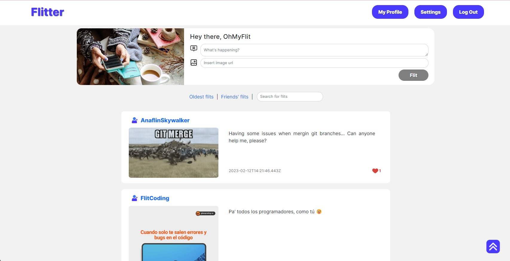

# FLITTER - PROYECTO FINAL

## Bootcamp _Mujeres en Tech_ by KeepCoding

Front End de aplicación web, clon de twitter, desarrollada con Vue.js, Vuex y Axios usando Typescript.

La aplicación recoge los datos de la siguiente API, desarrollada para este proyecto:

[Back End - Flitter](https://github.com/carolina-CortezFreudenthal/api-flitter)

## Demo





## Puesta en marcha

Project setup

```
npm install
```

Compiles and hot-reloads for development

```
npm run serve
```

Compiles and minifies for production

```
npm run build
```

Lints and fixes files

```
npm run lint
```

## Autoras:

-   Ana Vírseda Sanz
-   Carolina Cortez Freudenthal
-   María Ángeles Córdoba García Consuegra
-   Paloma Montero Merello
-   Sofia Romero Kamermann
